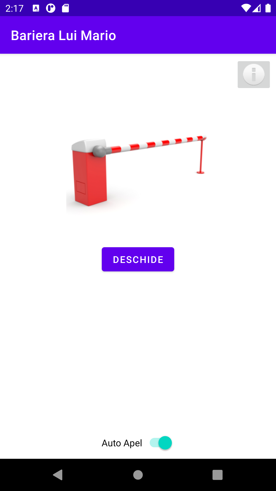

# Gate

## Scenario
The gate owner can open the gate by making a phone call to the Gate phone number. The gate opens only if the calller is the gate owner.
In order to give access to other people to open the gate, this Android application comes in play:
* a known and registered person sends an SMS message to the owner of the gate
* if the SMS sender is indeed known and registered, the Gate application does automatically make a phone call to open the gate
